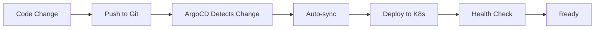

# ArgoCD GitOps Setup

## 📋 Overview

This directory contains ArgoCD configuration for continuous deployment of the E-Commerce microservices platform using GitOps methodology.

## 🏗️ Directory Structure

```
argocd/
├── install/
│   ├── namespace.yaml          # ArgoCD namespace
│   └── install.sh              # Installation script
├── projects/
│   └── microservices-project.yaml  # AppProject with policies
├── applications/
│   ├── product-catalog.yaml    # Product Catalog application
│   ├── user-management.yaml    # User Management application
│   └── app-of-apps.yaml        # App of Apps pattern
└── README.md                   # This file
```

## 🚀 Quick Start

### 1. Install ArgoCD

**Option A: Using the install script**
```bash
chmod +x argocd/install/install.sh
./argocd/install/install.sh
```

**Option B: Using Ansible**
```bash
cd ansible
ansible-playbook playbooks/deploy-argocd.yml
```

**Option C: Manual installation**
```bash
kubectl create namespace argocd
kubectl apply -n argocd -f https://raw.githubusercontent.com/argoproj/argo-cd/v2.9.3/manifests/install.yaml
```

### 2. Access ArgoCD UI

```bash
# Port forward ArgoCD server
kubectl port-forward svc/argocd-server -n argocd 8081:443

# Get initial admin password
kubectl -n argocd get secret argocd-initial-admin-secret -o jsonpath="{.data.password}" | base64 -d

# Open in browser
open https://localhost:8081
```

**Login credentials:**
- Username: `admin`
- Password: (from command above)

### 3. Install ArgoCD CLI (Optional)

**macOS:**
```bash
brew install argocd
```

**Linux:**
```bash
curl -sSL -o /usr/local/bin/argocd https://github.com/argoproj/argo-cd/releases/latest/download/argocd-linux-amd64
chmod +x /usr/local/bin/argocd
```

**Login via CLI:**
```bash
argocd login localhost:8081 --username admin --insecure
```

## 📦 Deploy Applications

### Deploy AppProject

```bash
kubectl apply -f argocd/projects/microservices-project.yaml
```

### Deploy Individual Applications

```bash
# Deploy Product Catalog
kubectl apply -f argocd/applications/product-catalog.yaml

# Deploy User Management
kubectl apply -f argocd/applications/user-management.yaml
```

### Deploy All Applications (App of Apps Pattern)

```bash
kubectl apply -f argocd/applications/app-of-apps.yaml
```

## 🎯 ArgoCD Features Configured

### AppProject: `microservices`

- **Source Repositories**: Allow all repositories (restrict in production)
- **Destinations**: `default`, `microservices`, `monitoring`, `elk-stack` namespaces
- **Resource Whitelist**: Services, Deployments, StatefulSets, ConfigMaps, Secrets, Ingress, HPA
- **Sync Windows**: 
  - Allow sync anytime with manual trigger
  - Deny auto-sync during maintenance (2 AM - 4 AM)
- **Roles**:
  - Developer: View and sync applications
  - Admin: Full access

### Application: `product-catalog`

- **Language**: Python/FastAPI
- **Port**: 8000
- **Replicas**: 2 (auto-scaled 2-5)
- **Resources**: 200m CPU / 256Mi RAM (request), 500m CPU / 512Mi RAM (limit)
- **Auto-sync**: Enabled with self-healing
- **Prune**: Enabled (removes resources not in git)
- **Health Checks**: Liveness and readiness probes
- **Ingress**: Enabled with TLS

### Application: `user-management`

- **Language**: Go/Gin
- **Port**: 8080
- **Replicas**: 2 (auto-scaled 2-5)
- **Resources**: 100m CPU / 128Mi RAM (request), 300m CPU / 256Mi RAM (limit)
- **Auto-sync**: Enabled with self-healing
- **Prune**: Enabled
- **Health Checks**: Liveness and readiness probes
- **Ingress**: Enabled with TLS and rate limiting

## 🔧 Configuration

### Update Git Repository

**Before deploying, update the repository URL in:**
- `argocd/applications/product-catalog.yaml` (line 23)
- `argocd/applications/user-management.yaml` (line 23)
- `argocd/applications/app-of-apps.yaml` (line 16)

Replace:
```yaml
repoURL: https://github.com/YOUR_ORG/bestproject2.git
```

With your actual repository URL.

### Helm Values Override

Both applications use Helm charts. To override values:

**Via Application YAML:**
```yaml
source:
  helm:
    values: |
      replicaCount: 3
      resources:
        requests:
          cpu: 300m
```

**Via values file:**
```yaml
source:
  helm:
    valueFiles:
      - values-production.yaml
```

### Sync Policy Options

**Auto-sync with self-healing:**
```yaml
syncPolicy:
  automated:
    prune: true
    selfHeal: true
```

**Manual sync only:**
```yaml
syncPolicy: {}
```

**Selective sync:**
```yaml
syncPolicy:
  syncOptions:
    - CreateNamespace=true
    - PrunePropagationPolicy=foreground
```

## 📊 Managing Applications

### CLI Commands

```bash
# List all applications
argocd app list

# Get application details
argocd app get product-catalog

# Sync application
argocd app sync product-catalog

# Sync all applications
argocd app sync --all

# Rollback to previous version
argocd app rollback product-catalog

# Delete application
argocd app delete product-catalog

# Set sync policy
argocd app set product-catalog --sync-policy automated

# View application logs
argocd app logs product-catalog

# View application diff
argocd app diff product-catalog
```

### UI Operations

1. **Dashboard**: View all applications and their health
2. **Application Details**: Click app → See resources, events, logs
3. **Sync**: Click "SYNC" → "SYNCHRONIZE"
4. **Rollback**: "HISTORY & ROLLBACK" → Select version → "ROLLBACK"
5. **Refresh**: "REFRESH" → Updates from git
6. **Diff**: "APP DIFF" → See pending changes

## 🔐 Security Best Practices

### 1. Change Default Password

```bash
argocd account update-password
```

### 2. Enable SSO

Configure SSO with OIDC providers (GitHub, Google, Okta):

```yaml
# argocd-cm ConfigMap
data:
  url: https://argocd.example.com
  oidc.config: |
    name: GitHub
    issuer: https://github.com
    clientID: $client-id
    clientSecret: $client-secret
```

### 3. RBAC Configuration

```yaml
# argocd-rbac-cm ConfigMap
data:
  policy.csv: |
    p, role:developer, applications, get, */*, allow
    p, role:developer, applications, sync, */*, allow
    g, developers, role:developer
```

### 4. Secrets Management

Use Sealed Secrets or External Secrets Operator:

```yaml
# Example: External Secrets
apiVersion: external-secrets.io/v1beta1
kind: ExternalSecret
metadata:
  name: postgres-secret
spec:
  secretStoreRef:
    name: aws-secrets-manager
  target:
    name: postgres-secret
  data:
    - secretKey: password
      remoteRef:
        key: prod/postgres/password
```

### 5. Network Policies

```yaml
apiVersion: networking.k8s.io/v1
kind: NetworkPolicy
metadata:
  name: argocd-server
  namespace: argocd
spec:
  podSelector:
    matchLabels:
      app.kubernetes.io/name: argocd-server
  ingress:
    - from:
        - namespaceSelector:
            matchLabels:
              name: ingress-nginx
      ports:
        - protocol: TCP
          port: 8080
```

## 🔄 GitOps Workflow

### 1. Development Workflow



### 2. Deployment Process

1. **Developer** pushes code to Git repository
2. **CI/CD** builds and pushes Docker image
3. **Developer** updates Helm chart with new image tag
4. **ArgoCD** detects change in Git
5. **ArgoCD** syncs application to Kubernetes
6. **Kubernetes** performs rolling update
7. **ArgoCD** monitors health and rollback if needed

### 3. Rollback Process

```bash
# Via CLI
argocd app rollback product-catalog

# Via Git
git revert <commit-hash>
git push origin main
# ArgoCD auto-syncs to previous version
```

## 📈 Monitoring & Observability

### Application Health

ArgoCD monitors:
- **Healthy**: All resources running as expected
- **Progressing**: Deployment in progress
- **Degraded**: Some resources unhealthy
- **Suspended**: Application suspended
- **Missing**: Resources not found

### Sync Status

- **Synced**: Git matches cluster
- **OutOfSync**: Git differs from cluster
- **Unknown**: Cannot determine sync status

### Metrics

ArgoCD exposes Prometheus metrics:

```yaml
# ServiceMonitor for Prometheus
apiVersion: monitoring.coreos.com/v1
kind: ServiceMonitor
metadata:
  name: argocd-metrics
spec:
  selector:
    matchLabels:
      app.kubernetes.io/name: argocd-server
  endpoints:
    - port: metrics
```

**Key Metrics:**
- `argocd_app_info` - Application information
- `argocd_app_sync_total` - Sync count
- `argocd_app_health_status` - Health status

## 🐛 Troubleshooting

### Issue: Application stuck in "OutOfSync"

```bash
# Check diff
argocd app diff product-catalog

# Hard refresh
argocd app sync product-catalog --force

# Replace resources
argocd app sync product-catalog --replace
```

### Issue: Sync fails with permission error

```bash
# Check AppProject permissions
kubectl get appproject microservices -n argocd -o yaml

# Check RBAC
argocd account can-i sync applications 'microservices/*'
```

### Issue: Application shows "Unknown" health

```bash
# Check resource status
kubectl get all -n microservices

# Check ArgoCD application controller logs
kubectl logs -n argocd -l app.kubernetes.io/name=argocd-application-controller
```

### Issue: Auto-sync not working

```bash
# Check sync policy
argocd app get product-catalog -o yaml | grep -A 5 syncPolicy

# Enable auto-sync
argocd app set product-catalog --sync-policy automated
```

## 🔗 Useful Links

- [ArgoCD Documentation](https://argo-cd.readthedocs.io/)
- [ArgoCD Best Practices](https://argo-cd.readthedocs.io/en/stable/user-guide/best_practices/)
- [GitOps Principles](https://opengitops.dev/)
- [Kubernetes Patterns](https://kubernetes.io/docs/concepts/cluster-administration/manage-deployment/)

## 📞 Support

For issues or questions:
1. Check ArgoCD logs: `kubectl logs -n argocd -l app.kubernetes.io/name=argocd-server`
2. Review application events: `argocd app events product-catalog`
3. Check sync status: `argocd app sync product-catalog --dry-run`
4. Consult [ArgoCD Slack](https://argoproj.github.io/community/join-slack)

---

**Happy GitOps! 🚀**
